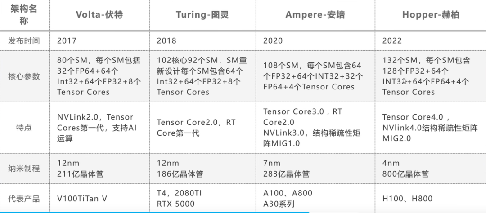

# 基础概念
+ GPU (Graphical Processing Unit)：硬件
+ CUDA core：处理单元，硬件
+ Tensor core：乘加融合的处理单元，硬件
+ SM（Streaming Multiprocessor）：基本计算模块，含多个CUDA core、Tensor core，硬件
+ CUDA（Compute Unified Device Architecture）：并行计算架构，软/硬件结合
+ nvcc：GPU程序的编译器，其实就是针对CUDA特殊化的gcc编译器，软件
+ kernel：一个并行程序，软件
+ wrap：CUDA执行的基本调度单元，软/硬件结合


## core是什么？


以3090为例，cpu有多少个core？gpu有多少个core？


```python
import torch
gpu_info = torch.cuda.get_device_properties(0)
print(f"GPU 型号: {gpu_info.name}")
print(f"GPU中的SM(Streaming Multiprocessors)的数量: {gpu_info.multi_processor_count}")
print(f"Core的数量: {gpu_info.multi_processor_count * 64}   //对于大多数GPU架构，每个SM通常有64个CUDA核心")
```

    GPU 型号: NVIDIA GeForce RTX 3090
    GPU中的SM(Streaming Multiprocessors)的数量: 82
    Core的数量: 5248   //对于大多数GPU架构，每个SM通常有64个CUDA核心
    

如果是A100， 它拥有 6,912 个 CUDA 核心 和 432 个 Tensor 核心。\
如果是H100， 它拥有 16,896 个 CUDA 核心 和 528 个 Tensor 核心。

为什么tensor core数量相对于CUDA core少很多？这其实是GPU设计要考虑的事情，需要在通用计算能力和专用计算加速之间找到平衡。\
CUDA Core更通用、面积小、成本低，而Tensor Core虽然专用，但更复杂、面积大、更贵。

集群中的cpu的core会有多少呢？


```python
import psutil
# 获取CPU核心数量
cpu_physical_cores = psutil.cpu_count(logical=False)  # 物理核心数量
cpu_total_cores = psutil.cpu_count(logical=True)      # 总核心数量（包括逻辑核心，例如超线程）

print(f"CPU 物理核心数量: {cpu_physical_cores}")
print(f"CPU 总核心（逻辑）数量: {cpu_total_cores}")
```

    CPU 物理核心数量: 52
    CPU 总核心（逻辑）数量: 104
    

二者相比，我们就能感受到gpu的core会多到什么程度。\
同时，我们可以发现，cpu可以通过超线程可以实现逻辑核心，但gpu是没有逻辑核心概念的。

事实上，GPU 的计算核心通常可以概括为以下几种类型：
+ CUDA Core
    + 这是 NVIDIA GPU 中最基本的计算单元，可以执行一个简单的计算操作
    + 不如CPU核心通用和强大，但是CUDA的核心优势是数量巨大，并且能够同时并行地对不同数据集进行计算。
    + SIMD架构使得成百上千个CUDA核心能够同时处理一个数据集，从而在更短时间内完成数据处理。
    + 主要用于向量类的计算操作。
+ Tensor Core
    + 特殊设计的NVIDIA GPU核心, 专门用于加速深度学习计算，理论上可以加速 8 倍。
    + Tensor 核心利用融合乘加算法(fused multiply-addition algorithms)加快计算速度，而且对模型的最终效果几乎没有损失。
    > 融合乘加: 乘法和加法操作合并成一个单一的操作，由硬件在一个步骤中完成，从而减少计算延迟和提高性能。
    + 主要用于 矩阵乘法（GEMM）和卷积操作 。

此外，流处理器（SM）算是GPU的一个计算模块，它通常包含若干 CUDA 核心（例如，64 个 CUDA 核心），以及其他组件如寄存器、共享内存等。GPU 中的 SM 数量决定了 GPU 的并行处理能力。\
至于一个SM具体包含多少CUDA核心，这取决于GPU架构，下面是NVIDIA GPU 架构的演进：

\
值得留意的是，我们熟知的V100、T100、A100、H100正是Volta、Turning、Ampere、Hopper的代表产品。\
此外，4代架构提供的Tensor Core在计算精度上的支持也是不同的，越往后提供越多的精度。

## Kernel到底是什么？
kernel在cuda中指的是一个函数，当一个kernel被调用的时候，gpu会同时启动很多个线程来执行这一个kernel，这样就实现了并行化；\
每个线程执行这一kernel将通过线程号来对应输入数据的下标，这样保证每个thread执行的kernel一样，但是处理的数据不一样。

核函数的几个经典前缀：
+ `__global__`:在GPU上执行，可以在CPU上被调用，也可以在GPU上被调用
+ `__device__`:在GPU上执行，只能在GPU上被调用
+ `__host__`:在CPU上执行，只能在CPU上被调用
+ `__constant__`：定义存储在 GPU 常量内存中的变量（所有线程可访问，但只读）。
+ `__shared__`：定义存储在 GPU 共享内存中的变量（线程块内共享的内存）。
+ `__managed__`：定义可以被 CPU 和 GPU 访问的变量（自动管理内存迁移）。
+ `__align__`：设置数据的内存对齐方式（提高内存访问效率）。

展示一个kernel的代码示例（二维矩阵乘法）：
```cpp
typedef struct{ //定义 Matrix
    int width;
    int height;
    float* elements;
} Matrix;
 
#define BLOCK_SIZE 16 //宏定义，定义了 CUDA 线程块的大小为 16x16。即每个线程块包含 16 行 16 列的线程。
 
__global__ void MatMulKernel(const Matrix, const Matrix, Matrix); //声明了一个 CUDA 核函数（将在 GPU 上执行），用于矩阵乘法计算。输入是三个 Matrix 类型的参数（两个输入矩阵和一个输出矩阵）。

void MatMul(const Matrix A, const Matrix B, Matrix C){
    // 为矩阵 A、B 和 C 在 GPU 上分配内存，并将矩阵 A 和 B 的数据从主机（CPU）拷贝到设备（GPU）。C用于存放输出，不需要拷贝
    Matrix d_A;
    d_A.width = A.width;
    d_A.height = A.height;
    size_t size = d_A.width * d_A.height * sizeof(float);
    cudaMalloc(&d_A.elements,size);
    cudaMemcpy(d_A.elements,A.elements,size,cudaMemcpyHostToDevice);
 
    Matrix d_B;
    d_B.width = B.width;
    d_B.height = B.height;
    size_t size = d_B.width * d_B.height * sizeof(float);
    cudaMalloc(&d_B.elements,size);
    cudaMemcpy(d_B.elements,B.elements,size,cudaMemcpyHostToDevice);
 
    Matrix d_C；
    d_C.width = C.width;
    d_C.height = C.height;
    size_t size = d_C.width * d_C.height * sizeof(float);
    cudaMalloc(&d_C.elements,size);
    
    // 通过之前声明的block size定义了一个 dimBlock
    dim3 dimBlock(BLOCK_SIZE,BLOCK_SIZE);
    // 定义Grid
    // 容易得知，结果C的形状应该是A.height*B.width；
	// 因为grid的形状是(x,y)类型，即C有x列，y行，所以应该写成 (B.width / dimBlock.x,A.height / dimBlock.y)
    dim3 dimGrid(B.width / dimBlock.x,A.height / dimBlock.y);
    // 调用 CUDA 核函数
    MatMulKernel<<<dimBlock,dimGrid>>>(d_A,d_B,d_C);
 
    // 将结果从 GPU 拷贝回主机
    cudaMemcpy(C.elements,d_C.elements,size,cudaMemcpyDeviceToHost);
    // 释放 GPU 上分配的内存。
    cudaFree(d_A.elements);
    cudaFree(d_B.elements);
    cudaFree(d_C.elements);
}
 
__global__ void MatMulKernel(Matrix A, Matrix B, Matrix C){ //实现了之前的函数声明
    float Cvalue = 0;
    // 这里求对应A矩阵的第row行以及B矩阵的第col列
    int row = blockIdx.y * blockDim.y + threadIdx.y;
    int col = blockIdx.x * blockDim.x + threadIdx.x;
	//这里是根据矩阵相乘的运算法则，也即A的一行乘以B的一列，然后求和得到一个值。
	//例如，C[1,2]就是A的第一行和B的第二列每个元素相乘再相加，得到的一个值。
    for(int i=0;i<A.width;i++){
        Cvalue += A.elements[row * A.width + i] * B.elements[i * B.width + col];
    }
    C.elements[row * C.width + col] = Cvalue;
}
```
参考博客：https://blog.csdn.net/zjy1175044232/article/details/120842857

### grid？block？wrap？网格、块、束，粒度从大到小的线程调度单位！

通过上面的例子，其实已经能感受到：block 和 grid 是用于组织和管理 GPU 上并行计算的基本单位。可以将它们看作是 GPU 计算资源的组织结构。\
具体来说：从GPU至线程的关系依次为：`显卡（GPU）->网格（grid）->线程块（block）-> 线程束（wrap）->线程（thread）` 。grid和block最大为3维，当然也可以1维。
+ 网格(grid)：__每个kernel的启动都会创建一个Grid, 是由多个block组成的集合__，可以说kernel的所有线程都在这个网格范围内，__数量不定__。
+ 线程块(block)：block内包含多个wrap，所有wrap中的线程都在同一个SM中，同时执行相同的指令（SIMT：单指令多线程），__线程数量不定，wrap数量=block中的总线程数 ÷ 32。__ \
block之间可以通过“同步”和“共享内存”进行协作，block之间的区分通过“blockIdx”
+ 线程束（wrap）：warp是GPU硬件层面执行的基本单元，一个warp通常由 __32个并行线程__ 组成。
+ 线程(thread)：一个线程块可以包含很多个thread，thread之间区分通过threadIdx，当然如果block不一样，threadIdx肯定需要继续区分
+ dim3: CUDA提供的专用类型,可以同时用于表示一维、二维和三维的线程块和网格大小(grid和block最大为3维)。
    ```cpp
    //dim3结构有三个输入：x,y,z
    dim3 dd;//dd.x,dd.y,dd.z 默认为1
    dim3 dd(2,3);//dd.x==2,dd.y==3,dd.z==1

    //一般定义如下
    dim3 grid(2,3);//就是定义一个网格，里面包含2*3*1个block
    dim3 block(4,5);//就是定义一个线程块，里面包含4*5*1个thread
    ```
+ blockIdx/threadIdx: 是dim3类型变量（整型），是索引线程的关键，对某个线程的索引：blockIdx.x/y/z,threadIdx.x/y/z
+ gridDim/blockDim: 也是dim3类型变量，是检查线程维数的关键，对某个线程所属的网格维数、线程块维数进行检测：gridDim.x/y/z,blockDim.x/y/z
+ 即便对于超大维度的tensor，cuda也可以通过这样的方式去拆分。

注意：一个grid可以涉及多个SM，但一个block、wrap都只会涉及一个SM。


参考博客：https://blog.csdn.net/QLeelq/article/details/127284410


### kernel跟cpu有没有关系？

在CUDA编程中，所有的kernel都必须涉及到CPU，但kernel的具体执行是在GPU上完成的。

## cpu和gpu的分工与协作？
我们可以简单理解为，GPU主要负责计算和存储部分数据，而CPU主要负责控制：
+ 启动和管理kernel，当你在代码中调用dkern<<<1, 1>>>();时，实际上是由CPU指令告诉GPU去执行这个内核函数。
+ CPU负责将数据从主机内存传输到设备内存，并在GPU完成计算后将结果传回主机内存。

CPU和GPU之间的协作主要是通过PCIe总线（Peripheral Component Interconnect Express Bus）来实现的，它是一种高速的串行通信接口，可以连接不同的设备和组件。\
CPU和GPU之间的协作过程大致如下：
+ CPU首先从内存或硬盘中读取程序和数据，并将其分配给不同的线程（Thread）或进程（Process）进行执行。
+ CPU根据程序中的指令，判断哪些计算任务需要交给GPU来处理，例如渲染图形、加速视频、训练神经网络等。
+ CPU将这些计算任务打包成一些命令列表（Command List），并通过PCIe总线发送给GPU。
+ GPU接收到命令列表后，将其分解成一些更小的工作单元（Work Unit），并分配给不同的流处理器(SM)来并行执行。
+ GPU完成计算任务后，将结果通过PCIe总线返回给CPU。
+ CPU根据结果继续执行后续的程序，并将最终的输出显示在屏幕上或保存在硬盘上。
通过这样的协作方式，CPU和GPU可以发挥各自的优势，提高计算机的性能和效率。

此外，一旦kernel被启动，CPU和GPU是独立运行的，除非显式地调用同步函数（如cudaDeviceSynchronize()），否则CPU不会等待GPU完成任务，CPU和GPU可以并行工作。\
（在某些情况下，CPU需要与GPU进行同步，例如在启动下一个内核或获取结果之前等待GPU完成前一个任务）

<u>CPU和GPU都会牵涉数据的存储和传输，有什么区分吗？</u>
+ CPU负责的数据：各种结果或者不需要并行计算的数据，主要包括原始输入数据、非并行计算任务的数据、中间结果、任务调度和管理相关的数据等。
+ GPU负责的数据：计算要用到的中间数据，主要包括需要大规模并行处理的数据、GPU专用的中间数据、频繁访问的数据、内核计算所需的常量数据等。
