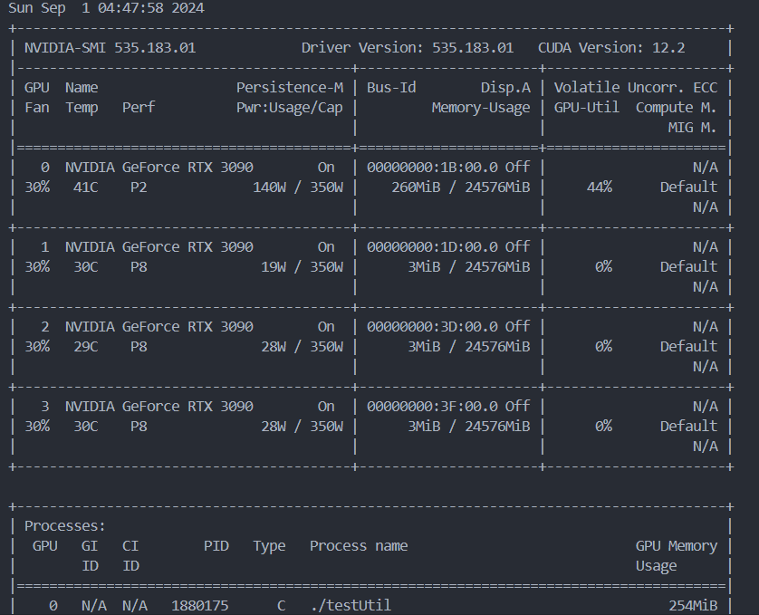
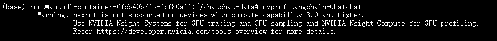
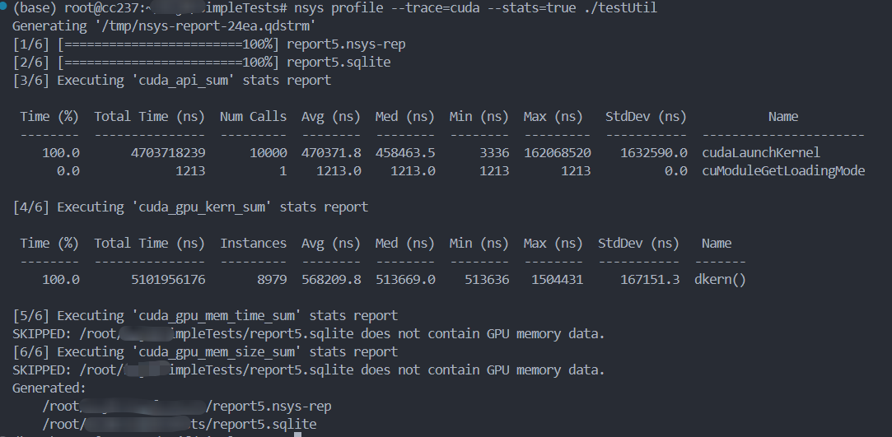
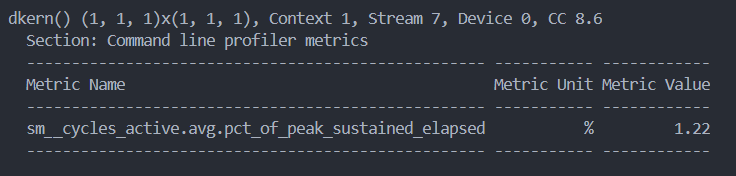
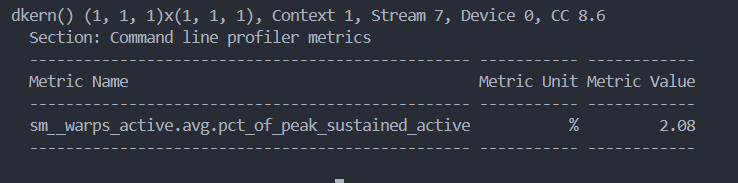

## 利用率？
关于gpu利用率，很多人都存在一些误区。\
硬件的利用率一般默认为运行时间占比，但这里有个问题，我们需要去区分是gpu-level还是core-level的利用率呢？\
对于gpu-level，但凡有一个core在使用，也可以代表gpu也在被使用啊；对于core-level，那每个core就需要分开来讨论了。

对于cpu而言，它引入了cpu share的概念。例如，在 Kubernetes 环境下，"100m" 的 CPU share 意味着这个容器有 10% 的单核 CPU 资源。通过这种方式，CPU 利用率可以被量化。\
遗憾的是在 GPU 上，目前并没有像 CPU share 这样的标准化量化方式。


### 根据nvidia-smi或者nvidia-smi pmon查看的利用率是什么？
先看官方定义：
> Percent of time over the past sample period during which one or more kernels was executing on the GPU.The sample period may be between 1 second and 1/6 second depending on the product.

翻译一下：采样时间段内，1个及其以上的核（kernel）运行的时间的占比。这个采样时间段取多长，跟产品相关，可能值1/6s~1s。
划重点：“one or more kernels”。这个意味着里面只要有1个kernel在执行，你的GPU利用率也可以很高。 而1个kernel不是一定让GPU内部的运算单元（core）都工作的。只要记住一个事实：GPU利用率99%，并不能说明你的GPU就使出了99%的力气。这个利用率只能说明，有kernel在运算，至于算得怎么样，算力发挥出来了没有，光看这个利用率是判断不出来的。

nvidia-smi反映的是在过去的采样周期内，GPU上是否有一个或多个kernel正在执行。
利用率 (%) 指的是在采样期间内，GPU上有计算任务正在执行的时间比例。例如，如果显示50%的利用率，意味着在采样周期内，有一半的时间GPU正在执行kernel，另一半时间GPU是空闲的。

即使利用率为100%，也不意味着所有CUDA cores都在满负荷工作。它仅表示在采样周期内，GPU上有任务在运行。

**相当于说，nvidia-smi看的是gpu-level的时间利用率，而不是空间利用率（core-level）**。

参考博客：https://zhuanlan.zhihu.com/p/346389176， https://stackoverflow.com/questions/40937894/nvidia-smi-volatile-gpu-utilization-explanation

我们可以尝试在机器上跑下述代码来验证对nvidia-smi中利用率的理解
```cpp
#include <stdio.h>
#include <unistd.h>
#include <stdlib.h>

const long long tdelay=1000000LL; //定义了GPU内核中循环等待的时间（以GPU时钟周期为单位）。
const int loops = 10000; //定义了CPU循环执行的次数。
const int hdelay = 1; //定义了CPU在每次循环中调用usleep()时的延迟时间（单位是微秒）。

__global__ void dkern(){ //定义了一个kernel，它通过clock64()函数获取当前的GPU时钟，然后在一个while循环中一直等待，直到经过了tdelay的时间。

  long long start = clock64();
  while(clock64() < start+tdelay);
}

int main(int argc, char *argv[]){

  int my_delay = hdelay;
  if (argc > 1) my_delay = atoi(argv[1]); // 解析参数，允许用户通过命令行设置my_delay的值。
  for (int i = 0; i<loops; i++){ // 使用一个for循环，循环次数为loops，在每次循环中启动dkern内核，然后调用usleep()引入延迟。
    dkern<<<1,1>>>();
    usleep(my_delay);}

  return 0;
}
```
在这个程序中，dkern内核被启动后，GPU开始执行，而CPU在执行usleep(my_delay)后继续进行下一次循环。这种设计使得CPU和GPU可以并行工作。
当my_delay较小时，CPU在启动内核后很快进入下一次循环，并立即启动下一个GPU内核。这种情况下，GPU可以连续地处理任务，保持高利用率。
总而言之，my_delay参数的值越大，CPU每次启动新任务的间隔时间更长，GPU在两个任务之间空闲的时间变多，即GPU有更多时间处于空转状态。所以这个程序可以验证nvidia-smi展示的是不是时间利用率。\
接下来对程序进行编译和运行：
```sh
nvcc -o testUtil testUtil.cu
```
编译后，就可以通过设置my_delay的值来控制这个程序在GPU的活动时间，在3090机器上，`./delay_program 100`可以达到100%的utilization，但是`./delay_program 1000`就只有44%的utilization.


### 那如何获取空间利用率呢？

目前国内几乎没怎么去研究这个问题，通过调研[NVIDIA forum](https://forums.developer.nvidia.com/search?q=sm%20occupation)了解到几个工具或许能够用上：pytorch profile、nsight 和nvidia dcgm。考虑到硬件的支持，pytorch profile我不太看好，尤其是对于LLM这种有大量操作的应用来说，这种方案的加载速度很慢。后面的两个方案都可以用。

在指标的选择上，可以使用SM occupation（注意不是SM utilization，这个其实就是nvidia-smi dmon看到的利用率），一个SM包含了多个core，而且SM是CUDA最基本的计算模块，所以这个指标可以代表空间利用率。


### Nsight System

### Nsight profile

注意概念上的一个定义：<u>profile是对程序而言的，不是对GPU集群。</u>

首先说nvidia profile，其实展示效果相当于tensorboard profile，但更加全面、快速。

踩坑1：nvprof不支持8.0以上的算力 \


Nsight profile是nvprofile的升级版，对应的指令是`nsys profile`。会返回很多指标，并且支持通过graphics工具进行可视化。例如：
```sh
nsys profile --trace=cuda --stats=true ./your_application
```
效果为：


这里观测的`testUtil`仍然是上面的代码，`stats`是展示输出信息的摘要（不是完整的）。\
同时，profile会生成一个nsys-rep，前者可以通过`nsys`再次读取，也可以通过`export`功能导出为csv或者sqlite文件


下面的实现参考于博客: https://developer.nvidia.com/zh-cn/blog/measuring-the-gpu-occupancy-of-multi-stream-workloads/
```sh
nsys profile --gpu-metrics-device=N 
```

获取到sqlite文件后，执行下述代码进行分析即可：
```python
import sys 
import json 
import pandas as pd 
from nsys_recipe import data_service, log 
from nsys_recipe.data_service import DataService 
 
# To run this script, be sure to add the Nsight Systems package directory to your PYTHONPATH, similar to this: 
# export PYTHONPATH=/opt/nvidia/nsight-systems/2023.4.1/target-linux-x64/python/packages 
 
def compute_utilization(filename, freq=10000): 
    service=DataService(filename) 
    table_column_dict = { 
        "GPU_METRICS": ["typeId", "metricId", "value"], 
        "TARGET_INFO_GPU_METRICS": ["metricName", "metricId"], 
        "META_DATA_CAPTURE": ["name", "value"] 
    } 
    hints={"format":"sqlite"} 
    df_dict = service.read_tables(table_column_dict, hints=hints) 
    df = df_dict.get("GPU_METRICS", None) 
    if df is None: 
        print(f"{filename} does not contain GPU metric data.") 
        return
    tgtinfo_df = df_dict.get("TARGET_INFO_GPU_METRICS", None) 
    if tgtinfo_df is None: 
        print(f"{filename} does not contain TARGET_INFO_GPU_METRICS table.") 
        return
    metadata_df = df_dict.get("META_DATA_CAPTURE", None) 
    if metadata_df is not None: 
        if "GPU_METRICS_OPTIONS:SAMPLING_FREQUENCY" in metadata_df['name'].values: 
            report_freq = metadata_df.loc[ metadata_df['name']=='GPU_METRICS_OPTIONS:SAMPLING_FREQUENCY']['value'].iat[0] 
            if isinstance(report_freq, (int,float)): 
                freq = report_freq 
                print("Setting GPU Metric sample frequency to value in report file. new frequency=",freq)                 
      
    possible_smactive=['SMs Active', 'SM Active', 'SM Active [Throughput %]'] 
    smactive_name_mask = tgtinfo_df['metricName'].isin(possible_smactive) 
    smactive_row = tgtinfo_df[smactive_name_mask] 
    smactive_name = smactive_row['metricName'].iat[0] 
    smactive_id = tgtinfo_df.loc[tgtinfo_df['metricName']==smactive_name,'metricId'].iat[0] 
    smactive_df = df.loc[ df['metricId'] == smactive_id ] 
      
    usage = smactive_df['value'].sum() 
    count = len(smactive_df['value']) 
    count_nonzero = len(smactive_df.loc[smactive_df['value']!=0]) 
    avg_gross_util = usage/count 
    avg_net_util = usage/count_nonzero 
    effective_util = usage/freq/100
      
    print(f"Avg gross GPU utilization:\t%lf %%" % avg_gross_util) 
    print(f"Avg net GPU utilization:\t%lf %%" % avg_net_util) 
    print(f"Effective GPU utilization time:\t%lf s" % effective_util) 
    return metadata_df 
      
if __name__ == '__main__': 
    if len(sys.argv)==2: 
        compute_utilization(sys.argv[1]) 
    elif len(sys.argv)==3: 
        compute_utilization(sys.argv[1], freq=float(sys.argv[2])) 
```
代码里的nsys_recipe我也查了半天nvidia的github，看到`/usr/local/cuda-12.4/NsightSystems-cli-2024.2.1/target-linux-x64/python/packages/nsys_recipe/requirements/common.txt`时才发现端倪，原来是需要安装CLI才能够使用，这个库是cli中提供的python接口。

值得一提的是，nsight现在支持jupyter了，可以在[pypi.org](https://pypi.org/search/?q=nsys&o=-created)中查到： [jupyterlab-nvidia-nsight](https://pypi.org/project/jupyterlab-nvidia-nsight/)

### Nsight Computer
通过Nsight Compute工具也可以观测到

通过[官方文档](https://docs.nvidia.com/nsight-systems/UserGuide/index.html#overview)了解到：
> These metrics provide an overview of GPU efficiency over time within compute, graphics, and input/output (IO) activities such as: \
> IO throughputs: PCIe, NVLink, and GPU memory bandwidth \
> SM utilization: SMs activity, tensor core activity, instructions issued, warp occupancy, and unassigned warp slots

也就是说，我们只能从SMs activity, tensor core activity, instructions issued, warp occupancy, and unassigned warp slots这几个指标去获取SM的相关利用率。

此外，文档里也提到，kernel很难被优化到100%的tensor core利用率

再读一下[官方文档](https://docs.nvidia.com/nsight-systems/UserGuide/index.html#available-metrics)，查到了获取sm activity的命令：
`ncu --metrics sm__cycles_active.avg.pct_of_peak_sustained_elapsed  ./testUti`，效果为：\
 \

此外，获取warp active的命令：
`ncu --metrics sm__warps_active.avg.pct_of_peak_sustained_active ./testUtil 100`，效果为：\



### DCGM


nsys 和 ncu 这类 NVIDIA 工具通常是用于分析正在执行的程序的,通常需要附加到正在执行的进程或者通过命令行启动分析任务。这种结果通常是程序结束后的。

而DCGM是针对与数据中心去观测的，甚至支持DCGM Exporter工具，可以衔接上Kubernetes使用。与nvidia-smi一样，结果可以是同时的。

根据[官方github](https://github.com/NVIDIA/DCGM)的方案去安装dcgm

通过下述命令查看性能分析：
```sh
sudo systemctl start nvidia-dcgm
# 通过 -l 了解有哪些参数可以查看，其中10002、10003分别对应
dcgmi dmon -l
# 查看列表发现1002、1003对应于SM occupation，是我们要的指标
dcgmi dmon -e 1002

# 也可以针对指定程序监控
# 启动监控
dcgmi stats --host 127.0.0.1 -g 0 -e
# 暴露某个程序的信息
dcgmi stats --host 127.0.0.1 -g 0 -p <pid> -v
```
踩坑2：dcgm的性能分析模块(例如1002、1003)仅支持 Tesla/Quadro 级 GPU，不支持 RTX/GTX GPU，也不支持任何容器。

### NVML

nvml（NVIDIA Management Library ）这个库也提供相应的功能，而且有python库（pynvml）。NVML已经有比较广泛的应用，比如NVIDIA-smi就是基于NVML库做的.