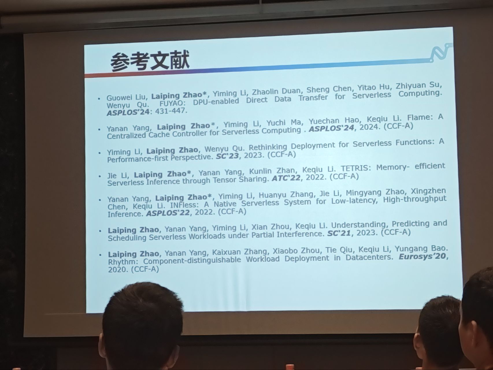
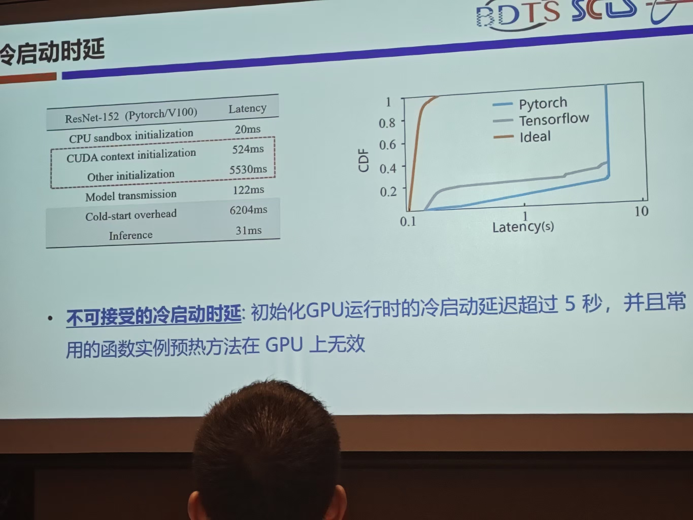
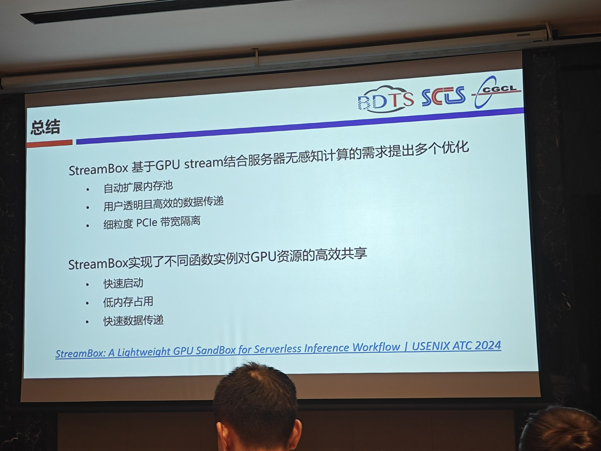

# NCSC比赛复盘

有幸入围了这一次的CCF服务计算创新大赛的决赛，成功混到了宁波三日公费游！

这其实是我第二次参加这个会议了，但这次是以正式的参赛选手身份进去的，不用再悄咪咪带导师牌子去混了。

9.12日上午就轮到了我们组来汇报，自我感觉发挥得还行。但也有很多要反省和学习的：

1. 有一个关于“服务链路刻画”的问题回答得并不太好，没有迅速地get到评委老师的点。
2. pre时的姿态不够谦逊，言行举止有时候可能显得过于自信了？
3. 项目本身还不够成熟，相关成果那块太空缺了。**任你说得天花乱坠，缺少成果就很难证明项目的价值。**

最终比赛得了三等奖，离二等奖应该就差一点点了，很可惜。（一等奖不敢妄想了，神仙打架）

不管怎样，总是学习到了很多经验，也涨了些见识，看到了同龄人的作品，明白自己缺乏了什么就是最重要的。

# 印象比较深的几个讲座：

本来是抱着追星的目的，去观望一下金鑫老师主持的《服务器无感知的新型云服务系统》论坛，结果真的听到了几个比较有价值的报告。

## 天津大学 赵来平老师 Serverless OS

赵老师以PaaS为着眼点，提出了一个观点：“既然用户只能看到Platform，那Platform以下的内容就可以随便折腾了。”也就是说，在用户不可见的领域，我们没必要按照传统层次去构建工作流。

这一观点对于Serverless还是相当好用的，于是赵老师团队以此为抓手，进行了一些传统层次的融合，例如“垂直融合”或者“水平融合”，相当于是做了一个Serverless OS了。这样的架构相比于传统方案更加简洁，更有探索空间。同时，随着层次的减少，通信次数可能也会更少。赵老师组里相关的参考文献如图所示：

## 清华大学 李振华老师 xxxx

李老师的报告非常生动有趣，十分吸引人。他以目前最热的“黑神话”为引，讲到云游戏，进而讲到他们自己的最新工作。研究的视角独特而且深入。

由于这篇研究尚未发布，我答应了李老师要对相关内容进行保密，这里就暂不赘述了。等公开后，再更新这部分内容。

## 华中科技大学 黄卓 StreamBox

现有的Serverless每次启动一个函数都会产生一个独立的GPU 运行时（即, CUDA context）隔离，这对于短生命周期和细粒度的函数来说过于笨重，导致了高启动延迟、高显存占用和高通信开销等问题。如图所示：

这篇工作使用了GPU Stream的技术让多个函数实例共享GPU资源，从而减少了启动运行时的次数，降低了冷启动。

函数间共享资源的方案已经很常见了，只是这里共享的是GPU资源。

但哪些函数可以用来共享呢？共享后会不会带来新的隐患呢？这些问题还需要从论文中寻找答案。
