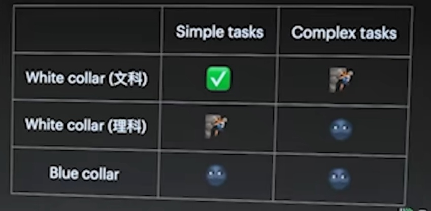
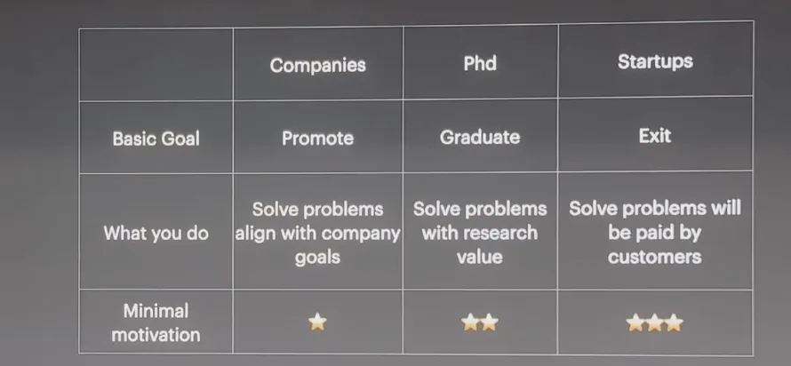

## 资源瓶颈
以前跑训练模型就像“炼丹”，数据就是药材，算法就是丹方。

带宽资源很难控制，多卡更近是大趋势（一般用水冷，能带走更大热量），因为光纤多一米都会对性能有影响（光速其实挺慢的，跑一米要3ns）

显卡上划分一片内存后，其实就放不下太多其它的。这块的工艺可能会受限，以后的单卡模型的尺寸可能也因此被固定。

算力主要就是看工艺那些。当尺寸足够大的时候，供电可能反而会成为问题，一个大的数据中心，说不定需要一个造电厂来供应。

对于知识库的数据，规模达到10T~50T可能就差不多了。人类的历史数据和经验，虽然规模比这大的多，但其密度、质量未必会高很多。所以数据规模达到一定程度后再扩大，也未必会提升很多。
｜ 突发奇想！数据质量真的越高越好吗？稀疏性的会不会在大规模下会不会有奇效？

## models are good or good enough？
    language gets good，80～85分
    audio good enough，70－80分
    video usable for special application，50分，还有很多空间
    multimodal，多模态是未来的趋势

用户习惯很重要，以前都是“刷一刷、点一点”，但这样的方式或许能满足80％的需求，但chatgpt出来后，一些细节的需求可以通过长文本完成。其实就像微信一样，当文本太长了，大家可能会更加习惯于语音输入，所以这块以后可能会很自然地发展起来。

贴合用户习惯就容易形成killer app，上一代的killer app是短视频。当然，用户习惯也会慢慢被塑造改变，所以下一代会是什么还未知。

## 模型取代人类工作？
| 只要一个行业能被采集到足够的数据，它就能自动化。
+ 对于文科白领：普通文书工作都可以被取代了，创造性工作还在努力。
+ 对于理工科白领：以前模型可以取代“搜索Stack Overflow然后copy下来”的工作，因为它本就被这样训练了。理工科简单的工作其实还勉强可以，但对于复杂的、创造性的任务，它还不能取代。
+ 对于蓝领，也是世界的绝大部分人群：跟世界去交互其实还很复杂，机器人来取代这件事其实还要很多年。像“自动驾驶”这样的封闭情况下，技术取代都搞了这么多年。像服务员端盘子等情况，就需要更久了，10年都不一定可以。

｜ 这块的应用是个浪潮和大趋势，先从一些特定场景出发，例如无人驾驶、工业互联网等等。

## 预训练和后训练的性质变了
在以前，预训练是个技术活【模型架构和高质量数据决定效果】，后训练（微调）是个工程活【模型架构是固定的】；现在有点反过来了，大模型的预训练是个工程活【参数量和数据决定效果】，后训练反而是技术活了【不同的场景数据适用于不同的算法，其实相当难搞】

以前公认的是要做“垂直模型”，因为通用模型可能在遇到你这个领域时需要指数级的数据投入，没必要通用；但现在发现其实一个很垂直的模型，它的通用能力也不错。

｜ 想要在某个学科上得到第一，那你的其他学科可能也都不差。

评估很重要，做好了评估就知道新的方向，同时也能拿到一些数据。

数据决定模型的上限，算法决定模型的下限。所以大家其实70％多的时间都还在准备数据。
｜ 目前大模型还是“填鸭式教育”，离AGI还很远

## 打工，读博和创业的动机和优缺点
｜ minimal motivation
+ 在大公司，如果你做的和公司想做的不一样，就会处处受制。（company goal）
  + 环境相对稳定
  + 呆的越久，学的越少
  + 停留在固定思维（打工人、职业经理人）

+ 读phd，你需要做的是让研究有价值，有创意。（research value）
  + 其实有50％的时间花在写作和演讲上，锻炼表达能力
  + 有几年时间可以专注在某个领域（反正也赚不了钱，想不了别的）
  + 可以和一些公司的研发去合作，但很少有机会参与大项目
  + 课题、导师风格都很挑人
  + 需要真的热爱，正反馈略久，需要学术界的认同

+ 创业，（paid by customers）
  + 惊险刺激，抢到机会就爽到了，抢不到就死了
  + 直面复杂的社会，能最快速的学习，是最好的历经苦难的方法（没有上级，没法逃避）
  + 婴儿般的睡眠，每3个小时都会醒来
  + 需要更强烈的热爱，正反馈更久，需要社会和市场的认同

### 强烈的动机来自于欲望和恐惧：
+ 欲望：越底层越好（名、利、权）
+ 恐惧：能让人抑郁、甚至感受到生死的
+ 将这些转化为积极向上的动机：逃避、放纵满足不了欲望，也缓解不了恐惧。

## 一个持续提升自我的方法
+ 从上级的角度总结：
  + 我是懒：那就直面这个事情
  + 我是蠢：换别的方向，或者花比别人更多时间去做
  + 其他的原因，总之要直面自己的问题

  | 如果对自己持续的狠，就会成为一个特别牛逼的人。如果不能狠，那就一步步慢慢升上去。

这是最好的时代，因为新技术带来新的机会；同时也是最坏的时代，因为新一代需要付出比上一代人更多的努力。